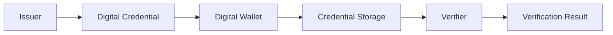
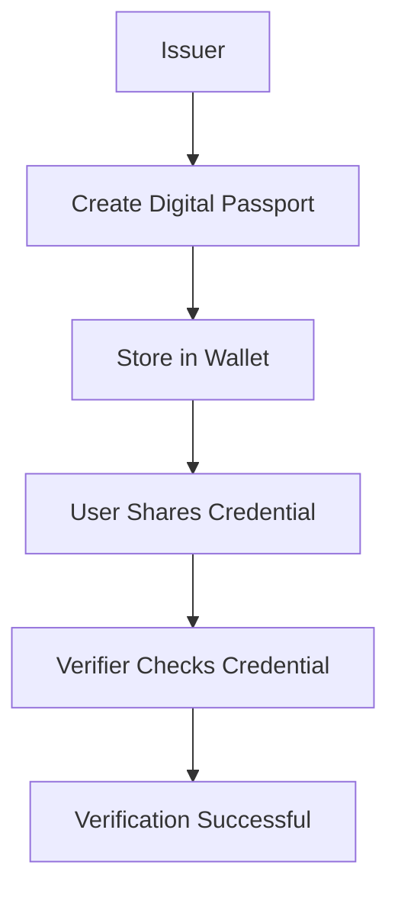

<div align="center">

# 🛂 Digital Passport App

### **Secure Digital Identity Verification Platform**

*A React-based simulation of a digital passport ecosystem that demonstrates secure credential issuance, digital wallet management, and identity verification.*

<p>


</p>

**Issue • Store • Verify • Protect Digital Credentials**

</div>

---

# 📑 Table of Contents

* [Overview](#-overview)
* [Features](#-features)
* [Application Preview](#-application-preview)
* [Architecture](#-architecture)
* [Technology Stack](#-technology-stack)
* [Project Structure](#-project-structure)
* [Installation](#-installation)
* [How It Works](#-how-it-works)
* [Application Workflow](#-application-workflow)
* [Future Enhancements](#-future-enhancements)
* [Learning Outcomes](#-learning-outcomes)
* [Contributing](#-contributing)
* [Author](#-author)
* [License](#-license)

---

# 📖 Overview

Digital Passport App is a web-based simulation of a modern digital identity ecosystem. The application demonstrates how trusted organizations can issue digital credentials, how users can securely store those credentials inside a digital wallet, and how third-party organizations can verify them without requiring physical documents.

The project is designed for educational purposes to showcase concepts related to digital identity, credential management, and identity verification workflows.

---

# ✨ Features

## 🏛️ Issuer Simulation

* Simulates credential issuance
* Generates digital passport credentials
* Transfers credentials securely to the user's wallet

---

## 👛 Digital Wallet

* Stores issued credentials
* Displays passport information
* Provides a simple credential management interface

---

## ✅ Verifier Simulation

* Simulates identity verification
* Validates issued credentials
* Demonstrates secure verification workflow

---

## 🎨 Modern User Interface

* Responsive layout
* Built with React
* Styled using Tailwind CSS
* Clean and intuitive design

---

# 📸 Application Preview

> Replace these placeholders with actual screenshots from your application.

```text
screenshots/
│
├── home.png
├── wallet.png
├── issuer.png
├── verifier.png
└── demo.gif
```

```markdown


```

---

# 🏗️ Architecture



---

# 💻 Technology Stack

| Category        | Technology       |
| --------------- | ---------------- |
| Frontend        | React 19         |
| Styling         | Tailwind CSS     |
| Language        | JavaScript (ES6) |
| Build Tool      | Create React App |
| Version Control | Git & GitHub     |

---

# 📂 Project Structure

```text
digital-passport-app/

├── public/
│
├── src/
│   ├── components/
│   │   ├── WalletView.js
│   │   ├── IssuerSimulation.js
│   │   └── VerifierSimulation.js
│   │
│   ├── App.js
│   ├── index.js
│   ├── App.css
│   └── index.css
│
├── package.json
├── tailwind.config.js
└── README.md
```

---

# 🚀 Installation

## Clone the Repository

```bash
git clone https://github.com/rishikasinha29/digital-passport-app.git
```

## Navigate to the Project

```bash
cd digital-passport-app
```

## Install Dependencies

```bash
npm install
```

## Start the Development Server

```bash
npm start
```

The application will be available at:

```text
http://localhost:3000
```

---

# ⚙️ How It Works

### Step 1 — Issue Credential

The Issuer Simulation creates a digital passport credential representing a trusted organization issuing identity information.

---

### Step 2 — Store Credential

The issued credential is stored inside the Digital Wallet where it can be managed by the user.

---

### Step 3 — Verify Credential

The Verifier Simulation checks the stored credential and demonstrates a basic verification process.

---

# 🔄 Application Workflow



---

# 📊 Project Highlights

| Feature                 | Status |
| ----------------------- | ------ |
| Credential Issuance     | ✅      |
| Digital Wallet          | ✅      |
| Credential Verification | ✅      |
| React Components        | ✅      |
| Responsive UI           | ✅      |
| Tailwind CSS            | ✅      |

---

# 🔮 Future Enhancements

* QR Code-based credential sharing
* Secure credential encryption
* Blockchain-backed credential verification
* Decentralized Identity (DID) support
* Verifiable Credentials (VC) compliance
* Biometric authentication
* Multi-user support
* Cloud database integration
* Digital signature verification
* Mobile application support

---

# 🎓 Learning Outcomes

This project demonstrates concepts including:

* React Component Architecture
* State Management
* Tailwind CSS
* Digital Identity Systems
* Credential Issuance
* Identity Verification
* Secure Information Sharing
* Frontend Application Development

---

# 🤝 Contributing

Contributions are welcome.

1. Fork the repository.
2. Create a feature branch.
3. Commit your changes.
4. Push your branch.
5. Open a Pull Request.

---

# 👩‍💻 Author

**Rishika Sinha**

Computer Science Engineering Student

VIT Bhopal University

📧 **Email:** [rishikasinha2909@gmail.com](mailto:rishikasinha2909@gmail.com)

🐙 **GitHub:** https://github.com/rishikasinha29

💼 **LinkedIn:** https://www.linkedin.com/in/rishika-sinha-38636828a

---

# 📜 License

This project was developed for educational and portfolio purposes.

© 2026 Rishika Sinha. All Rights Reserved.

---

<div align="center">

## ⭐ Support

If you found this project interesting, consider giving it a ⭐ on GitHub.

**Building the future of secure digital identity. 🛂**

</div>
